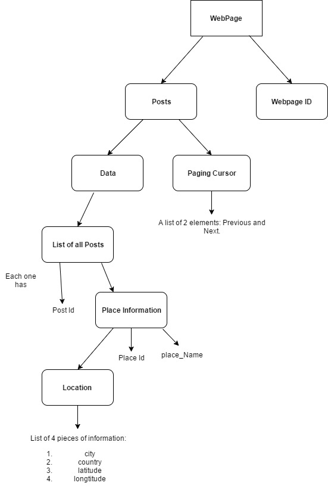
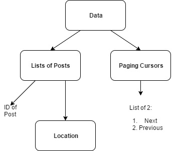
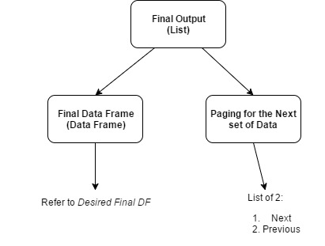

******
#Summary of Key Finidings:
*   It is easy to retrieve data from Facebook API using the functions provided by the __Rfacebook__. 
*   The facebook documentation does not provide specific information regarding [__Rate Limit__](https://developers.facebook.com/docs/graph-api/advanced/rate-limiting), 
    it specifies that the limit `differs depending on request`. 
    There was no rate limit related issues while working on this report.
    
*   The __Utils.R__ package within _Rfacebook_ provides example frameworks to parse 
    the response JSON nested list into an organized data frame.
    +   Refer to _MiniProject2_ for an example.
    
*   Facebook API V2.0 have heavy restrictions in terms of accessing personal information 
such as profile information, posts and comments of a user. 
Thus it is __not recommanded__ to scrape the facebook api to search for user related
information.

*   It is easy to access public data of facebook through its [__search API__](https://developers.facebook.com/docs/graph-api/using-graph-api#search). 
Information such as public pages, posts, comments and replies to comments. This makes it 
easy to track public posts/pages and how other users reacted to it.

*   It was observed that many pages, posts does not include _location_ 
    information as part of its content.

*   It is __recommanded__ to use the access token created through a developer's application. 
There is no expiration date for this type of access token. 

*   The [graph API Explorer](https://developers.facebook.com/tools/explorer/) tool is usefurl for testing API calls to understand structure 
as well as exploring possible fields and edges.

******


# Quick Introduction To Facebook API:

******

### Structure:

The Facebook API is in the form of a _graph_:
```{r echo=FALSE,results="asis"}
    
    structure = c(
        "nodes",
        "edges",
        "fields"
    )
    
    description = c(
        "Objects of facebook API. Nodes are \"things\" like Users, page, Group, comments etc.Each node has its' own ID that which is used to access it via the Graph API.",
        "The connections that leads from one node to another. For example: the cover photo of a user, the comments and posts on a user's timeline. 
        Edges are identified by a name",
        "Information about the nodes, like the names, Id, birthday etc of a user.Fields are identified by a name."
    )
    
    summary = data.frame(structure,description)
    knitr::kable(summary,col.names = c("Structure","Description"))
    
    rm(list=ls())

```


******

### Request Format:
*   The _API request_ is in the format of a standard HTTP request. 
Methods like __GET,POST, DELETE, etc__ can be used to retrieve 
and modify information of facebook users through the API. 
*   Format of a request:  
`GET graph.facebook.com /{node-id}/{edge-name}?fields = {first-level fields}{Second-level fields}`.
*  An access token is required to access any information.

******

### Pagnation:
*   To manage the amount of information returned per API Call, 
facebook divides the data using several pagnation techinques
(Cursors-based, Time-based and Offset-based).
*   Most commonly used and the only ones encountered during this report 
    are the curosr based pagnations. 
The information for pagnation is located under the _$paging_ subset of the response data 
and provides a _next_ token which is a HTTP GET request for the next page of data 
and a _previous_ token which is a HTTP GET request for the previous page of data. 
    +   If the provided paging request call returns _NULL_, the end/very beginning
        of the data is reached.
 
******  

### Rate Limit:
*   The type of rate limit dealt with mainly in this report is __Application-Level Rate Limiting__.
    Since only the application access key was used, others include [user access token](https://developers.facebook.com/docs/facebook-login/access-tokens#usertokens) 
    and [page access token](https://developers.facebook.com/docs/facebook-login/access-tokens#pagetokens)
*   The facebook API states that the limit for the application is __200 calls per hour per user in aggregate.__
*   However not all API calls are subjected to the rate limit. 
*   There is a tool that monitors the application's API calls 
and it is located under the dashboard of the application. [ Test Application](https://developers.facebook.com/apps/). 
Have to log in using the test user account or the account 
who owns the applications.

******

# Further Information:
*   [facebook API Overview](https://developers.facebook.com/docs/graph-api/overview)
*   [Facebook API Request Information](https://developers.facebook.com/docs/graph-api/using-graph-api)
*   [Facebook API Rate Limit](https://developers.facebook.com/docs/graph-api/advanced/rate-limiting)
*   [Facebook API Documentations](https://developers.facebook.com/docs/)


******
# Rfacebook Package:
*   [Rfacebook](https://cran.r-project.org/web/packages/Rfacebook/index.html)

## Summary of Findings For Rfacebook:
```{r echo=FALSE,results="asis"}
    
    advantages = c(
        "Clear documentation.",
        "High level of Abstraction, so no need to worry about the specifics.",
        "Good variety of functions that can provide data for data mining.",
        "The source code provides a structure to parse any arbitary facbook API response."
    )
    
    disadvantages = c(
        "Assumes that the data being searched for exists.If an error is thrown by the Facebook API, the search stops.",
        "Many functions are no longer supported due to upgraded Facebook API.",
        "Limited range of fields and edges, does not support the extraction of any arbitrary fields and edges.",
        "Many functions are deprecated due to API version update."
    )
    
    summary = data.frame(advantages,disadvantages)
    knitr::kable(summary,col.names = c("Advantages","Disadvantages"))
 rm(list = setdiff(ls(),c("folder_Path","token","FbObjectId") ))


```

******

## List of Deprecated Functions:
```{r echo = FALSE,results="asis"}

    functions = c("getCheckins","getFQLS","getFriends","getNetwork","searchFacebook")
    description = c("deprecated","deprecated",
                    "only your friends who uses your application",
                    "only applicable to users of your application"
                    ,"deprecated")
    table= data.frame(functions, description)
    knitr::kable(table,col.names=c("functions","description"))
```

******

## Setting Up Libraries

```{r libraries,message =F, results="hide"}
    ##Loading Libraries needed for the rest of the report:

    library(jsonlite)
    library(knitr)
    library(Rfacebook)
    knitr::opts_chunk$set(error=T,warning=TRUE)

    rm(list = ls())
```


******

## Creating Test Account:

*   _First name:_ Api-Testing
*   _Last name:_ nrc
*   _Email:_  NRC.API.Testing@gmail.com
*   _Password:_ NRCTesting123456!
*   _Birthday:_   July 1st 1997
*   _Gender:_ Males

******

## Creating Long Lasting Authorization Token With _fbOAuth_ Function:

*   Normally, a temporary access token normally has a 2 hour expiration time. 
A long-lived token(OAuth token) can be used for longer access. 
The following outlines how to obtain a long lived token:
    +   __The _fbOAuth_ function documentation in Rfacebook outlines the steps.
    +   [Mining Facebook Data Using R & Facebook API!](https://bigdataenthusiast.wordpress.com/2016/03/19/mining-facebook-data-using-r-facebook-api/) 
    also provides steps to creating a long lived token.


```{r}

    app_Id = 1353820787971442
    app_Secret = "4841ab73f4f68960ebbf37e5705e2610"
    
    ## The following shows the code that calls the fbOAuth function and creates the OAuth token, 
    ## it has been commented once executed and the result is saved in a file 
    ## called "my_OAuth.txt" Please run the following code and follow
    ## the instructions in the console in case the file does not exist.
    
   # token = fbOAuth(app_id = app_Id,app_secret = app_Secret,extended_permissions = TRUE)
   # if(!file.exists("My_OAuth"))
   #  {
   #      file.create("My_OAuth.txt")
   #      save(token, file= "My_OAuth.txt")
   #  }

load("My_OAuth.txt")
   rm(list = setdiff(ls(),c("token","FbObjectId") ))
```

*   The following pictures indicates where to navigate to set the extended permissions. 


******
# Exploring the Package:


******

## _Location:_
___GOAL: To try and explore what the facebook api offer regarding extracting location information.___


### Exploring Facebook API for Nodes that Contain Location Information:

```{r location nodes,echo=FALSE,results="asis"}
    
    nodes = c(
        "Albums.",
        "Comments",
        "Events",
        "Pages",
        "Posts",
        "Photos"
        
    )
    
    description = c(
        "Contains location field. Often returns null",
        "No location fields.",
        "Usually includes location information under place field with a valid location.",
        "Contains a location field, often yields no useful response.",
        "Contains a place field, but usually returns NULL when requested.",
        "Contains a place field for location."
    )
    
    summary = data.frame(nodes,description)
    knitr::kable(summary,col.names = c("Nodes","Description"))


```


******
## _callAPI_ Function:
*   The "callAPI" function delegates the task of retriving 
    information from the Facebook API to 
    the _GET()_ method in the _httr_ pacakge 
    and returns the facebook API response,

*   The main benefit is that the user can 
    pass in any arbitrary api request.
    ex: `https://graph.facebook.com/me?fields=birthday,age_range`
    and pass in the token generated from _fbOAuth_ token. The 
    user will have to parse the returned nested list.

*   Observation is that most facebook nodes needs
    to be referenced via its object id. 

*   Due to personal privacy protection, no useful information
    about other users(who has not granted acess to 
    the test application) were returned.

###   Trying to extract my profile information:
```{r}    

##Extracting my personnal information
my_Data = callAPI("https://graph.facebook.com/me", token)
## Extracting my ID, this can be passed on as the ids for other functions
my_id = my_Data$id
print(my_Data)

##Adding fields to the URL to gain specific information (birthday, age_range)
#no spaces anywhere within the URL should be included
my_Specific_Information_Request = "https://graph.facebook.com/me?fields=birthday,age_range"
my_Specific_Data = callAPI(my_Specific_Information_Request,token)

print(my_Specific_Data)


```


*****

### Developing a function to extract the "ID" of facebook object through using the URL of the object:

*   The idea behind is that to access detials regarding pages, posts etc, 
    the id is required. A simple function is made to extract that information.

```{r, echo = FALSE}
## ONLY VALID for SIMPLE Webaddresses with no id in the URL, ex: www.facebook.com/harrypotter

    FbObjectId = function(object_URL,token)
    {
        beginning_Index = 1
        # Checking the formating of the "object_URL"
        if(class(object_URL)!= "character"){
            warning("Object_URL is not a string")
        }else if( grep(pattern = "(http|https)://www.facebook.com(/.*)*"
                       , x=object_URL)!= beginning_Index ) {
    
             warning("Invalid URL")
        }
        
        #formating and checking the complete URL request to the facebook Graph API 
        complete_URL = paste("https://graph.facebook.com",object_URL,sep = "/")
        #print(complete_URL)
        
        #Extracting the ID of the facebook object
        url_Data = Rfacebook::callAPI(complete_URL,token)
        url_id = url_Data$id
        
        # If the Id is not numeric, something is wrong. 
        if(length( grep(pattern="www.facebook.com",x=url_id))!=0 ) {
              warning("Error In Returned ID: Not numeric values. 
                      URL likely not supported.")
        }
        
      url_id
    }

```


*   Test cases (all cases are behaving as expected)

```{r testing_FbObjectId,error=T, include = FALSE, eval = FALSE}
    
    ## For URLs that yield no ids, the facebook would return a version of the 
    ##URL address as the object ID.(just discovered)

    ## A URL of a post on the public facebook photo of Harry Potter 
    ##(This should also return an error)
    test1 = "https://www.facebook.com/harrypottermovie/photos/
    a.422515109312.180796.156794164312/10155042492264313"
    
    FbObjectId(test1,token)
    
    ## A comment on a public page (This should return an error)    
    test2 = "https://www.facebook.com/harrypottermovie/photos
    /a.422515109312.180796.156794164312/10155042492264313/
    ?type=3&comment_id=10155042702764313&
    comment_tracking=%7B%22tn%22%3A%22R4%22%7D"
    FbObjectId(test2,token)
    
    ## A URL of a public facebook page
    test3 = "https://www.facebook.com/harrypottermovie"
    FbObjectId(test3,token)
    
    ## A URL of a person's timeline (not my own)
    test4 = "https://www.facebook.com/FSXAC"
    FbObjectId(test4,token)
     rm(list = setdiff(ls(),c("token","FbObjectId") ))
```


******

## Exploring _getPage,getPost,getCommentReplies_:

 ___GOAL: To extract information regarding comments on a public facebook webpage___

    1:  Starting with getting the post_Ids (mainly post Ids) using _getPage_
```{r}
    
    require(Rfacebook)

    ## the getPage function returns a matrix, and one of the columns is the "postId"
    BBC_URL = "https://www.facebook.com/bbcnews"
    load("My_OAuth.txt")
    BBC_Id = FbObjectId(BBC_URL,token)
    print(BBC_Id)

    ## retrieving page information using
    ## getPage function
    page_Information = getPage(BBC_Id,token,n=2)
    names(page_Information)

    ## the post_Ids 
    post_Ids = page_Information$id
```

   
2:  Getting information about each post using _getPost_ 
    (mainly interested in comment ids)
    
```{r}
    ## trying to see getPost can be vectorized, it appears to be working through the use of lapply

    ## The return type is a list of posts and each element within this represents
    ##the information for a single post. Each "post" is a list composed of 
    ##three sections: "post","likes","comments".

    ## getting all the post information with 
    ## getPost function
    post_Information = lapply(post_Ids,getPost,n=100,token=token)
    
    names(post_Information[[2]])
     
```
    
  
3:  Now that I have obtained a list of comments, I can use the _getCommentReplies_ 
    to further investigate each reply to a comment.
    
```{r,error=T }   

    ## I have extracted the list of comments_Id from the post_information
    ## each element within the comments section contatins information 
    ## about comments to the post. 

    ## Extracting comment_ids

    comments = unlist( lapply(post_Information, function(x) {x["comments"]}), recursive = F)
    comments_Id = unlist(comments[[1]]["id"])
    

    #Extracting the comment replies to each posts' comments.

    ## First test the getCommentReplies with a single comment_Id:
    single_Comment_Reply = getCommentReplies(comments_Id[[1]],token=token)
    names(single_Comment_Reply)
    
    
    ##Now for all of the comment IdS via lapply.
    
    comment_Replies = lapply(comments_Id, function(x) getCommentReplies(x,token = token))
    
   length(comment_Replies)
   
```


#### What if the posts are pictures?

*   The information regarding attachments (such as photos and videos) 
    can be accessed using the _attachments_ edge. 
    However the Rfacebook pacakge does not seem to have explicit functions that support 
    the extraction of information regarding attachments. 

*   One way to extract this information is to use the _callAPI_ method with the 
    _attachments_ edge specified as part of the query. 

```{r,echo = F}
   rm(list = setdiff(ls(),c("folder_Path","token","FbObjectId") ))
```


******

## Exploring _searchGroup & getGroup_ functions:

* ___GOAL: To extract information regarding a public facebook group: 
[couponboutique](https://www.facebook.com/groups/couponboutique2/) 
using the getGroup function___

*   The _search string_ must be URLencoded.

1:  Suppose the ID is not known, or not certain. _searchGroup()_ can be used to extract the group_Id:
```{r error=TRUE}
    group_Name = URLencode("The Coupon Boutique")
    group_Id = searchGroup(group_Name,token=token)
    print(group_Id)
     
```


```{r}
    ## search string must be URLencoded.
    group_Name_URL = URLencode("The Coupon Boutique")
    group_Id2 = searchGroup(group_Name_URL,token=token)
    print(group_Id2)
```


2: Extracting information using _getGroups_
```{r, error=TRUE}
    start_Time = as.numeric(as.POSIXct("2016-12-01"))
    id = group_Id2$id[[1]]
    ##I have verified that this id is linked with the URL 
    #for the group I have shown at the beginning of this section. 
    print(id)
    
    ## NOTE: the "groupId" is different from the "pageId" 
    ## where the group is posting and hosting. 
    
    #NOTE: the default number of posts to return is 25.
    group_posts = getGroup(id,token=token)
    class(group_posts)
    names(group_posts)
    rm(list = setdiff(ls(),c("folder_Path","token","FbObjectId") ))
    
```


******

## Exploring _searchPage_:
*   This method works as shown in the documentation.
```{r}
    keyword ="Apples"
    data = searchPages(keyword,token, n=100)
    class(data)
   names(data)
   tail(data,n=2)
   rm(list = setdiff(ls(),c("folder_Path","token","FbObjectId") ))

```


******

## Trying _getLikes_:
*   ___GOAL:The documentation stated that it could provide information about 
a user or a page's likes given the id. 
I want to see if it works with user Ids that have been granted permissions to my application.___
*   ___Does not work on users but work on pages.___


******

#__Search API:__
*   Allows public searches on public information. 
*   [Search Documentation](https://developers.facebook.com/docs/graph-api/using-graph-api/v2.0#search)
*   __This API provides the same functionality as facebook's Search Bar.__
*   Query example: `https:graph.facebook.com/search?q={string to search for}&type={type name}&{fields of type}`
*   Allows:
    +   [users](https://developers.facebook.com/docs/graph-api/reference/user/)
    +   [page](https://developers.facebook.com/docs/graph-api/reference/page/)
    +   [place-topic](https://developers.facebook.com/docs/graph-api/reference/place-topic/)
    +   [event](https://developers.facebook.com/docs/graph-api/reference/event/)
    +   [group](https://developers.facebook.com/docs/graph-api/reference/v2.8/group/)
    +   [places](https://developers.facebook.com/docs/graph-api/reference/place/)
    

******

#__Mini Project1:__

## Description:
1:  To scrape the facebook API for all web pages that contains a series of keywords. 
    Up to 2000 pages, then graph distribution based on location.


## Code:

```{r}

     rm(list = setdiff(ls(),c("folder_Path","token","FbObjectId","ExtractList",
                              "RoughDF","MinRow","UnravelList") ))

    #Loading libraries
    library(Rfacebook)


    # setting up authorization token
    ## refer to above section for details
    load("My_OAuth.txt")


    keywords = c("flower")
    
    ##Note: there might not be the specified number of pages
    ##that will be returned as the result.
    webpage_Id= searchPages(keywords, token=token,n=2000)
    
    webpage_Location = webpage_Id$country
    webpage_Location[is.na(webpage_Location)] = "Not Provided"
    
    #presenting information:
    frequency_table = table(webpage_Location)
    par(cex=0.75)
    barplot(sort(frequency_table),las=2,main="Webpages that Mention Flowers by Country"
            ,ylab="Frequency",space=c(0.5))
    
    ## Replotting graphs to exclude the top 2 Countries. 
    frequency_table1= frequency_table
    for(i in 1:4)
    {
        frequency_table1= subset(frequency_table1, 
                                 frequency_table1 < max(frequency_table1))
    }
    barplot(sort(frequency_table1),las=2,main="Webpages that Mention Flowers
            by Country Excluding Top 4",ylab="Frequency",space=c(0.5))
    

```


***** 

# __MiniProject 2__:

## Description:
___To find the place most posted on a travel website from 500 posts. The main point is trying to illustrate the structure of the response and processing to a dataframe. __
*   note: sometimes there is no location tag, could consider searching for it in the text of the comment.
*   note: The _getPost_ function 


## Code:

### Gathering RawData:
```{r}

    rm()
    website_URL = "https://www.facebook.com/thousandamazingplacesonearth/"
    
    website_Id = FbObjectId(website_URL, token)
    
    #Making the query. I first tested this out on the Graph API Explorer
    ## Note: The limit for number of posts 
    query= paste("https://graph.facebook.com",website_Id, 
                 "?fields=posts.limit(100){place}",sep="/")
    
    #Pulling RawData
    raw_Data= callAPI(query,token)
    
    
    #Formatting the raw Data:
    ## I looked at the returned format again at the graph API explorer.
```


### Planning:


####Query Response Structure:



#### Paging Response Structure:



#### Desired Organized Output Structure:



#### Desired Final DF:


### Pesudocode For Parsing: 
__NOTE: This process is based on similar procedure as the source code of the Rfacebook Package. 
I do not take credit for the idea behind this parsing. 
I merely studied the structure of the Rfacebook source code and tried to adapts some parts of it. 
The functions that I studied are the [getPage](https://github.com/pablobarbera/Rfacebook/blob/master/Rfacebook/R/getPage.R) function,
the _pageToDF & UnlistWithNA_ functions under the  [Utils.R package](https://github.com/pablobarbera/Rfacebook/blob/master/Rfacebook/R/utils.R)

I strongly recommand to use the function _UnlistWithNA_(unavailable for direct access under the Rfacebook Package) 
under the [Utils.R package](https://github.com/pablobarbera/Rfacebook/blob/master/Rfacebook/R/utils.R) for parsing of queries not supported by the methods of the Rfacebook. _UnlistWithNa_ function includes pre-made parsing function for many possible fields. 
Furthermore, the general structure of this function can be adapted to parse JSON formatted information.__


### Parsing and Processing information.


```{r}
    num_Posts = 500
    post_Limit = 100
    
    #step 1 of described procedure: navigating to list of posts data.
    query_Data = raw_Data$posts$data
    
    #step 2 and 3; extracting information and formatting. 
    #This process is mostly done by the UnlistWithNA function. 
    #I will be producing a simple replicatation of it. 
    
    UnlistWithNA_Copy = function(field, list)
    {
        ## produce a list of NAs. 
        complete = rep(NA, length(list))
        
        if(length(field)==1)
        {
            ## produces a vector indicating which indices are null. 
            ##This is used to indicate which values to replace with NA.
            notNull = unlist(lapply(list,function(x) !is.null(x[[field]])))
            
            ## Combine the information within the fields as well as the NA_List to 
            ##form the complete and correct list regarding the                 field.
            ##NOTE: differences between [[]] selects the content and [] selects the corresponding 
            ##container
            
            complete[notNull]= unlist(lapply(list, function(x) x=x[[field]]))
            
        }
        
        if(length(field)==2)
        {
            ##similar logic as the above.
            notNull=unlist(lapply(list,function(x)!
                                      is.null(x[[field[1]]][[field[2]]])))
            complete[notNull]= unlist(lapply(list,function(x)
                x=x[[field[1]]][[field[2]]]))
            
        }
        if (length(field)==3){
		    notnull <- unlist(lapply(list, function(x) 
		    !is.null(x[[field[1]]][[field[2]]][[field[3]]])))
		
		    complete[notnull] <- unlist(lapply(list[notnull], 
		                      function(x) x = x[[field[1]]][[field[2]]][[field[3]]] ))
        }
        
         ##Note: for lists, data.frame corece it as a row. While for vectors,
         ##each vector is a column. Thus in order for each field to be its own column, 
         ##the list needs to be a vector
        return(as.vector(complete))
        
    }
    
    
    # Takes a list of data and extract the fields of interest and organize into a data frame.
    OrganizingDF = function(list)
    {
        # Constructing lists corresponding to the desired fields using the above
        # function.
    
        ##Similar Warning appeared that stated multiple of replacement length when
        ##the package is called orginally.
        
            post_Id=UnlistWithNA_Copy(c("id"), list)
            place_Id=UnlistWithNA_Copy(c("place","id"),list)
            place_Name=UnlistWithNA_Copy(c("place","name"),list)
            city=UnlistWithNA_Copy(c("place","location","city"),list)
            country=UnlistWithNA_Copy(c("place","location","country"),list)
            latitude=UnlistWithNA_Copy(c("place","location","latitude"),list)
            longitude=UnlistWithNA_Copy(c("place","location","longitude"),list)
            street=UnlistWithNA_Copy(c("place","location","street"),list)
            
        df = data.frame(post_Id, place_Id,place_Name,city,country,
                        latitude,longitude,street,stringsAsFactors = F)
        
        return(df)
    }
    
    
    
   
```

```{r}
     ##Continuing on with Data Processing: The query information is organized into a data frame.
    
    query_DF = OrganizingDF(query_Data)
   
    
    #Moving on to organizing the paging informations. This can be done in a loop. 
        ## Depending the number of posts desired, a custom function can be made 
##to calculate how many posts are requestd.
        ## By modifying the ".limit" modifier in the paging cursor, 
##you can specify the number of posts to return. 
##In this case, the maximum is 100, so i will need to loop through the cursors 4 times. 
    
    ## The format of the paging token location varies: For the initial query,
##it is under raw_Data$posts$paging[["next"]]. For any subsequent navigations, 
##it is under raw_Data$paging[["next"]]


    paging_Url = raw_Data$posts$paging[["next"]]
    for(i in (1:4))
    {
        #formatting paging_Url to extract 100 posts (post limit) eaech time
        paging_Url = gsub(pattern="place&limit=25", replacement = 
                              paste("place&limit=",post_Limit,sep=""), x=paging_Url)
        
        
        # Extracting the raw_Data from the new paging_Url
        raw_Data_Paging = callAPI(paging_Url,token)
        
        #formatting the data using the above functions into a data frame.
        response_DF = OrganizingDF(raw_Data_Paging$data)
        
        #Formating final output:
        query_DF = rbind(query_DF,response_DF)
        
        #Navigating to next paging cursor
        paging_Url = raw_Data_Paging$paging[["next"]]
    }
    
    dim(query_DF)
    
    
    # Now the matrix is organized, time to get it into the final output format.
    
    final_Out = list(query_DF, raw_Data_Paging$paging)
```
  

```{r}

    #finding most visited location:

    location = query_DF$country
    max_Location = max(location, na.rm=T)
    print(max_Location)

```

    