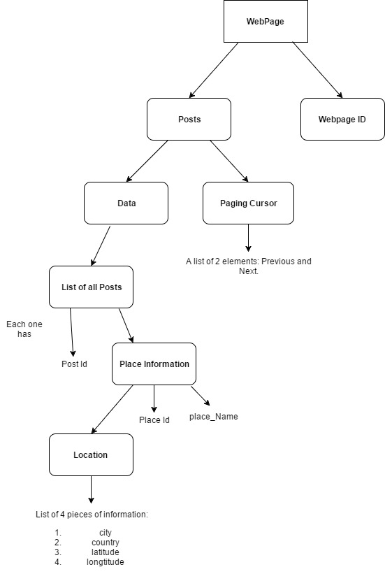
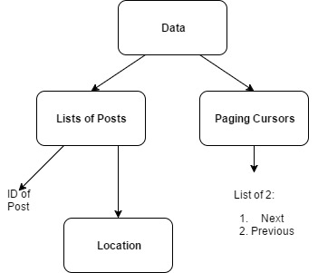

***** 


## Description:
___To find the place most posted on a travel website from 500 posts.__ 
__The main point is trying to illustrate the structure of the response and processing to a dataframe. __

*   note: sometimes there is no location tag, could consider searching for
    it in the text of the comment.


## Code:
```{r libraries,message =F, results="hide"}
    ##Loading Libraries needed for the rest of the report:

    library(jsonlite)
    library(knitr)
    library(Rfacebook)
    knitr::opts_chunk$set(error=T,warning=TRUE)

    rm(list = ls())
```


### Gathering RawData:
```{r}

    rm(list = ls())
    website_URL = "https://www.facebook.com/thousandamazingplacesonearth/"
    load("My_OAuth.txt")
    
    website_Id = "437841726243764"
    
    ##  Making the query. THe query was
    ##  first tested this out on the Graph API Explorer
    ##  Note: The limit for number of posts is capped 
    ##  at 100 for a page of response.
    ##  Additional responses needs to be retrieved
    ##  via cursors.
    
    query= paste("https://graph.facebook.com",website_Id, 
                 "?fields=posts.limit(100){place}",sep="/")
    
    #Pulling RawData
    raw_Data= callAPI(query,token)

```


### Planning:

*****

####Query Response Structure:


*****


#### Paging Response Structure:


*****


#### Desired Organized Output Structure:


*****

#### Desired Final DF:


*****

### Pesudocode For Parsing: 
__NOTE: This process is based on similar procedure as the source code of the Rfacebook Package.__
__No credit is taken for the idea behind this parsing.__
The structure of the Rfacebook source code was studied and parts of it was adapted. 
The functions that was studied are the [getPage](https://github.com/pablobarbera/Rfacebook/blob/master/Rfacebook/R/getPage.R) function,
the _pageToDF & UnlistWithNA_ functions under the  [Utils.R package](https://github.com/pablobarbera/Rfacebook/blob/master/Rfacebook/R/utils.R)

*   It is strongly recommended to use the function _UnlistWithNA_
    (unavailable for direct access in the Rfacebook Package) 
    under the [Utils.R package](https://github.com/pablobarbera/Rfacebook/blob/master/Rfacebook/R/utils.R) for parsing of queries not
    supported by the methods of the Rfacebook. _UnlistWithNa_ function includes 
    pre-made parsing function for many possible fields. 
    Furthermore, the general structure of this function can be adapted
    to parse JSON formatted information.__


### Parsing and Processing information.


```{r}
    num_Posts = 500
    post_Limit = 100
    
    #   navigating to list of posts data.
    query_Data = raw_Data$posts$data
    
    #   extracting information and formatting. 
    #   This process is mostly done by the UnlistWithNA function. 
    
    UnlistWithNA_Copy = function(field, list)
    {
        ## produce a list of NAs. 
        complete = rep(NA, length(list))
        
        if(length(field)==1)
        {
            ## produces a vector indicating which indices are not null. 
            notNull = unlist(lapply(list,function(x) !is.null(x[[field]])))
            
            ##  Combine the information within the fields as well as
            ##  the NA_List to 
            ##  form the complete and correct list.
            ##  NOTE: differences between [[]] selects the content and [] 
            ##  selects the corresponding container and the content
            
            complete[notNull]= unlist(lapply(list, function(x) x=x[[field]]))
            
        }
        
        ##  Multiple level of fields to parse through
        if(length(field)==2)
        {
            ##similar logic as the above.
            notNull=unlist(lapply(list,function(x)!
                                      is.null(x[[field[1]]][[field[2]]])))
            complete[notNull]= unlist(lapply(list,function(x)
                x=x[[field[1]]][[field[2]]]))
            
        }
        if (length(field)==3){
		    notnull <- unlist(lapply(list, function(x) 
		    !is.null(x[[field[1]]][[field[2]]][[field[3]]])))
		
		    complete[notnull] <- unlist(lapply(list[notnull], 
		                      function(x) x = x[[field[1]]][[field[2]]][[field[3]]] ))
        }
        
         ## Note: for lists, data.frame corece it as a row. While for vectors,
         ## each vector is a column. Thus in order for each field to 
         ## be its own column, 
         ## the list needs to be a vector
        return(as.vector(complete))
        
    }
    
    
    ## Takes a list of data and extract the fields of interest 
    ## and organize into a data frame.
    OrganizingDF = function(list)
    {
        # Constructing lists corresponding to the desired fields using the above
        # function.
    
        ##Similar Warning appeared that stated multiple of replacement length when
        ##the package is called orginally.
        
            post_Id=UnlistWithNA_Copy(c("id"), list)
            place_Id=UnlistWithNA_Copy(c("place","id"),list)
            place_Name=UnlistWithNA_Copy(c("place","name"),list)
            city=UnlistWithNA_Copy(c("place","location","city"),list)
            country=UnlistWithNA_Copy(c("place","location","country"),list)
            latitude=UnlistWithNA_Copy(c("place","location","latitude"),list)
            longitude=UnlistWithNA_Copy(c("place","location","longitude"),list)
            street=UnlistWithNA_Copy(c("place","location","street"),list)
            
        df = data.frame(post_Id, place_Id,place_Name,city,country,
                        latitude,longitude,street,stringsAsFactors = F)
        
        return(df)
    }
    
    
    
   
```

```{r}
    ## Continuing on with Data Processing: 
    ## The query information is organized into a data frame.
    
    query_DF = OrganizingDF(query_Data)
   
    
    ##  Moving on to organizing the paging informations. This can be done in a loop. 
    ##  Depending the number of posts desired, a custom function can be made 
    ##  to calculate how many pages of response are required.


    ## By modifying the ".limit" modifier in the paging cursor, 
    ##  you can specify the number of posts to return per page of response. 
    ##  In this case, the required number of posts is 500
    ##  a loop will be made to navigaet the cursors 4 times.
    
    ##  The format of the paging token location varies: For the initial query,
    ##  it is under raw_Data$posts$paging[["next"]]. For any subsequent navigations, 
    ##  it is under raw_Data$paging[["next"]]


    paging_Url = raw_Data$posts$paging[["next"]]
    for(i in (1:4))
    {
        #formatting paging_Url to extract 100 posts (post limit) each time
        paging_Url = gsub(pattern="place&limit=25", replacement = 
                              paste("place&limit=",post_Limit,sep=""), x=paging_Url)
        
        
        # Extracting the raw_Data from the new paging_Url
        raw_Data_Paging = callAPI(paging_Url,token)
        
        #formatting the data using the above functions into a data frame.
        response_DF = OrganizingDF(raw_Data_Paging$data)
        
        #Formating final output:
        query_DF = rbind(query_DF,response_DF)
        
        #Navigating to next paging cursor
        paging_Url = raw_Data_Paging$paging[["next"]]
    }
    
    dim(query_DF)
    
    
    # Now the matrix is organized, time to get it into the final output format.
    
    final_Out = list(query_DF, raw_Data_Paging$paging)
```
  

```{r}

    #finding most visited location:

    location = query_DF$country
    freq= table(location)
    freq=sort(freq)
    print(freq[length(freq)])

```

    