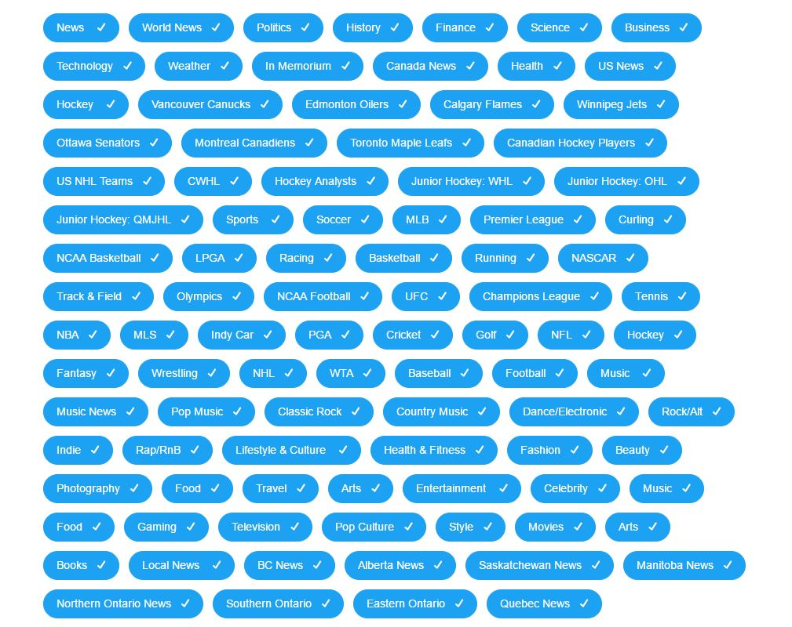
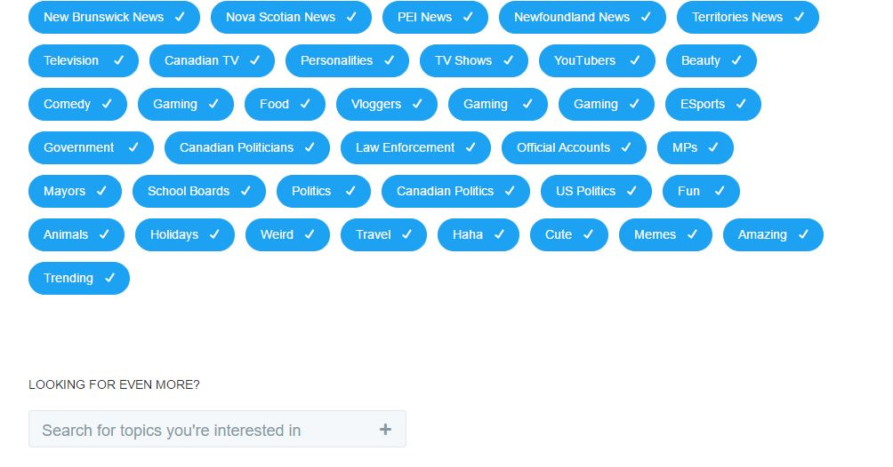
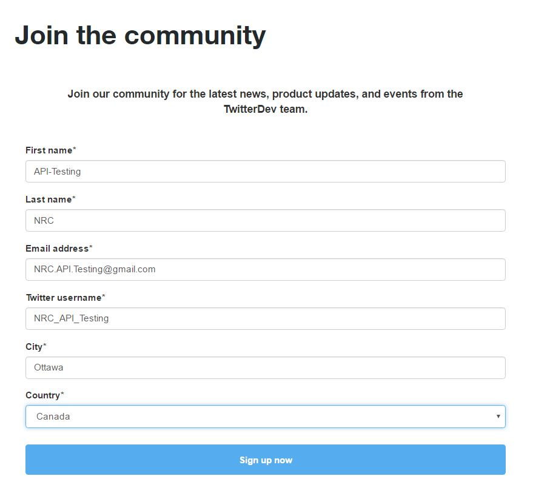

[Twitter API Documentation](https://dev.twitter.com/overview/api)

#__Making Test Email Account:__
*   _Name:_   API-Testing(first name) NRC(last name)
*   _Username/Email:_   NRC.API.Testing@gmail.com
*   _Password:_   NRCTesting123
*   _Birthday:_   July 1st 1997
*   _Gender_: Rather  not say

#__Making Test Twitter Account:__
*   _Username:_   NRC API-Testing
*   _Email:_  NRC.API.Testing@gmail.com
*   _Password:_   NRCTesting123
*   _Twitter Username:_ NRC_API_Testing
*   _Topics of Interest:_ (selected all available options)
    +   

    +   

#__Twitter Developer Registration:__
*   

#   Creating Test Application:
*   a placeholder URL was used for the website URL: `
https://www.placeholder.com`
*   Navigate to manage the application and click
_create Token_ to generate access token.

#   Package:
*   TwitterR package
*   Twitter does not 

#   Other Notes:
*   Twitter uses another type of security other
    than OAuth.
*   [TLS](https://dev.twitter.com/overview/api/tls)
    +   Essentially a special connection code returned by
        twitter sever upon "handshake" with local device.
*   [Intro Notes](https://www.youtube.com/watch?v=lT4Kosc_ers)

    

#__Overview:__
*   [Twitter Overview](https://dev.twitter.com/overview/api)
*   Four Main Objects:
    +   _Tweets_
    +   _Users_
    +   _Entities_
    +   _Places_

##Tweets:
*   Basic buliding block of Twitter, known as "status updates".
*   Can be embedded, replied to, liked, unliked and deleted
*   __[Tweets Field Guide](https://dev.twitter.com/overview/api/tweets)__
    +   _coordinates:_  Represents geographic location of this Tweet in geoJson format(longitude,latitude).
    +   _created_at:    UTC time of Tweet creation.
    +   Others such as: entities, favorite_count, favorited, fliter_level,places, text (of tweet),etc.

##Users:
*   User.
*   Can tweet, follow, create lists, home_timeline.
*   [Users Field Guide](https://dev.twitter.com/overview/api/users)
    +   description (of user), entities, follow_requests, favourites_count, id, profile_background,status, etc.

##Entities:
*   Provide metadata, contextual information about content posted on Twitter. 
*   [Entities Field Guide](https://dev.twitter.com/overview/api/entities)
    +   hashtags
    +   media (elements uploaded with the Tweet)
    +   urls
    +   user_mentions

##Places:
*   Places are specific, named locations with geo coordinates. 
*   [Places Field Guide](https://dev.twitter.com/overview/api/places)
    +   bounding_box: box of coordinated enclosing location
    +   country
    +   full_name
    +   id
    +   url

##Twitter IDs:
*   Beware that the IdS are often large numbers, > 53-bits. Some systems will truncate/simplify this number. Thus try to use _id_Str_ which is a string represenation of the number.

##Using Cursors:
*   [CUrsor Navigation](https://dev.twitter.com/overview/api/cursoring)
*   To retrieve cursored results, pass cursor with value of "-1".
    +   when sever responds _next_cursor = 0_, then last result is reached.
*   Example request:
    +   `GET https://api.twitter.com/1.1/followers/ids.json?screen_name=theSeanCook&cursor=1374004777531007833`

#__REST API:__
*   [REST API](https://dev.twitter.com/rest/public)
*   programmatic access to read and write Twitter data. 
    +   monitor process Tweets in real-time, use __[Streaming API](https://dev.twitter.com/rest/public)__
    

##Rate Limit:
*   Divided into 15 minute intervals. 
*   Per user-access token or Per application-only authentication.
*   __HTTP Headers and Response Codes:__
    +   HTTP headers can provide information for a given rate limit
        +   _X-Rate-Limit-Limit:_ rate limit ceiling for given endpoint
        +   _X-Rate-Limit-Remaining:_ number of requests left for 15 minute window
        +   _X-Rate-Limit-Reset:_ remaining window before rate limit resets, UTC epoch seconds
*   If two applications make the __GET__ requests to same user, the application rate limites are independent form eachother. 
*   However with __POST__ is on a per user basis, all applications share the same user token limit.
*   [Rate Limit Chart](https://dev.twitter.com/rest/public/rate-limits)
    +   __Different methods have different rate limits.__

## The Search API:

*   [Search API](https://dev.twitter.com/rest/public/search)
*   Allows queries against recent or popular Tweets.
*   Search API is focued on releveance, not completeness. Some tweets and users might be missing from search results. Match for completeness (Use Streaming API)
*   Building a query:
    +   1:  Try at [search engine](https://twitter.com/search-home)
    +   2:  The URL is the query request, which can be directly copied as a query.
    +   3:  Replace _"https://twitter.com/search"_ with _"https://api.twitter.com/1.1/search"_.
*   __Note: The search parameters/operators must be URL encoded. Which is why the search enginer twitter provides comes in handy. By looking at the URL of the returned result, you can get the URL encoded query paremeters.__
*   __Note: multiple query operators can be seperated using _AND_ and _OR_ operators__
    

## Working with Timelines:
*   Advise on keeping track of references through _max_id_ and _since_id_.
*   [Timeline](https://dev.twitter.com/rest/public/timelines)

## Collections:
*   Essentially a collection of tweets.
*   [Collections](https://dev.twitter.com/rest/collections/about)
*   Collections have slightly different response structures
    +   all _ids,cursors, collection positions_ are strings
    +   decomposed response where each object is groupe together and only presented once.
    +   [More Structure information](https://dev.twitter.com/rest/collections/responses)

#__Streaming API:__

##Overview
*   [Streaming API-Overview](https://dev.twitter.com/streaming/overview)
*   Low latency access to global stream of data. 
*   Mostly recent and up to date notifications.
*   Several endpoints with different uses:
    +   _Public Streams:_ Streams of public data through Twitter, used for specific users, topics and data mining.
    +   _User Streams:_ Single-user streams, all of data concerning single user's view. 
    +   _Site streams:_ Closed beta. Multiple user version of _User Stream_.

##Connecting to a Streaming Endpoint:
*   [Connecting to a Streaming Enpoint](https://dev.twitter.com/streaming/overview/connecting)
*   Establish long-lived HTTP request.
*   Accepts _OAuth_.
*   Connection is opened indefinitely, errors will interupt this connection.
*   _Some HTTP libraries process responses after connection closes. This will not work because information is incremently parsed._
*   _Disconnections:_
    +   Client establishes too many connections with same credentials. 
    +   Client stops reading data suddenly.
    +   Client reads too slowly. Too  much backed up by a queue.
    +   Twitter network changes. 
*   _Stalls:_
    +   Use 90 second timers between each new recieved request. The sever should send "keep-newline-alive" response every 30 seconds. If no new response within 90 seconds, then disconnect and reconnect. 
*   _Reconnecting:_
    +   Try to reconnect if an established connection drops.
    +   For more information refer to the Twitter Documentation.
*   _Rate Limitinng:_
    +   not limited to informaiton flow. 
    +   Rather limited attempts to reconnect too frequently (to change query), if backoff not implemented, too frequent break off. Then leads to rate limited.

##Processing Streaming Data:
*   [Twitter Processing Streaming Data](https://dev.twitter.com/streaming/overview/processing)
*   Response consists of a series of newline-delimited emssages, where "newline" is considered by _\r\n_ and the main message is in _JSON_.

*   _Missing counts:_
    +   In cases where field is taking too long to acheive, the response might contain incomplete fields. EX: _-1_ for numeric counts. Use REST API to retrieve accurate values. 
*   _Message Ordering:_
    +   No specific ordering. Usually delivered within a few seconds of a total ordering. A small portion may be delivered tens of seconds to several minutes out of order.
    +   Timelines may not be returned ordered, it is recommanded to sort it out of focus.
    +   Deleted messages may be delivered before orginal. 

*   Duplicate messages may be delivered.
*   _Gzip_ can reduce bandwidth, please refer to twitter documentation of this section for more information.

## Streaming API Parameters:
*   [Streaming API Parameters](https://dev.twitter.com/streaming/overview/request-parameters)
*   Allows for searching for specific phrases (track), specifiying geographical bounding boxes.

## Public Streams:
*   Enpoints:
    +   [POST statuses/filter](https://dev.twitter.com/streaming/reference/post/statuses/filter)
    +   Returns public statuses that match one or more filter predicates. Multiple paremeters can be specified.
    +   [GET statuses/sample](https://dev.twitter.com/streaming/reference/get/statuses/sample)
    +   Returns a small random sample of all public statuses.

## User streams:
*   [User Stream](https://dev.twitter.com/streaming/userstreams)  
*   Provide a stream of data and events specific to the authenticated user. 
*   [GET user](https://dev.twitter.com/streaming/reference/get/user)
*   Beware of simultaneous User Streams, there is a limit on how many connections can be held at once per OAuth application, regardless of IP. 
*   Applications need to be able to handle requests. 

#__Exploring Twitter API using Apigee:__
*   [Apigee Twitter API Console](https://apigee.com/console/twitter)
1:  I selected the _OAuth 1.0_ Option under the _Authentication_ tab at near the top and granted permissions

## Exploring _SearchAPI_:
*   The plan is to use both the [Twitter provided search engine](https://twitter.com/search-home) as well as the [Apigee Twitter API Console](https://apigee.com/console/twitter) to search the same query string and compare results to see if they are consistent with eachother. If not, what are the differences?

*   __General Query:__
    +   For the Twitter Search Engine, I typed in `love OR hate` and then selected the _latest_ tab. The returned results are a list of twitter tweets (replies, posts, etc) that are made tens of seconds ago. 
        +   It is important to note that this was the query I got in the URL of the twitter search engine: `https://twitter.com/search?f=tweets&vertical=default&q=love%20OR%20hate&src=typd`
    
    +   For the Apigee application,I copied the same parameters as the URL in the twitter search engine specified, namely: `https://api.twitter.com/1.1/search/tweets.json?f=tweets&vertical=default&q=love%20OR%20hate&src=typd`. 
        +   The returned results are not the same results generated by the search engine. However upon verifiying the creation date of the tweets returned by the apigee API console, the time of creation is also at the current time. 

    +   It would be interesting to compare the returned results of the R twitter package to see if it matches any of the two search engines (the Twitter search & the Apigee console).

*   __Combined Operators:__
    +   The two query strings I combined is: `#masterchef AND food:)`. 
    +   The twitter search engine returned a list of tweets that mentioned both `#masterchef` and mentioned `food` in a postitive connation (indicated with a `:)`).
        +   The returned encoded URL operator is: `%23masterchef%20AND%20food%20%3A)`
    +   the Apigee search engine, given the same query: `#masterchef AND food:)` returned no results. 
    +   It would appear that either my notation for searching the twitter Search API is incorrect (and Twitter search engine auto-corrected) or that maybe the Apigee software might be limited.
        +   I will retry the same query in R to explore if my syntax is correct.
        

* __Combined Operators:_
    +   The tested query is: `#CNN AND #BreakingNews`
    +   Both the Apigee API console and the twitter search engine produced the same results. 
    +   I do note that before I tried to search, the test twitter account was not allowed to follow anyone. Then after re-login, the error message was gone. 

## Exploring the _GET geo/search.json_ method in Apigee:

*   [geo/search method](https://dev.twitter.com/rest/reference/get/geo/search)
    +   Given latitude and longitude pair, IP address, or a name, this request will
        return a list of all places can be used as the _place_id_ when updating a status. 
        

# __Moving on to the _twitteR_ package__:
*   [twitteR Documentation](https://cran.r-project.org/web/packages/twitteR/twitteR.pdf)
    +   This particular pacakge is located on CRAN.

## Working Through Sample Analysis:
*   [Sample Analysis](http://www.rdatamining.com/docs/twitter-analysis-with-r)  

### Creating Authorization Token:
*   [Twitter OAuth Creation Guide](https://dev.twitter.com/oauth/overview/application-owner-access-tokens)

1:  Go to [apps.twitter.com](https://apps.twitter.com/)
2:  Create a new App or navigate to an application that has been created.
    +   I made an app under the test twitter account.
        +   _Name:_ Testing_Twitter_API
        +   _Description:_ Used to test and play around with Twitter API.
        +   _Website:_ placeholder
        +   _Callback URL:_ (left empty)